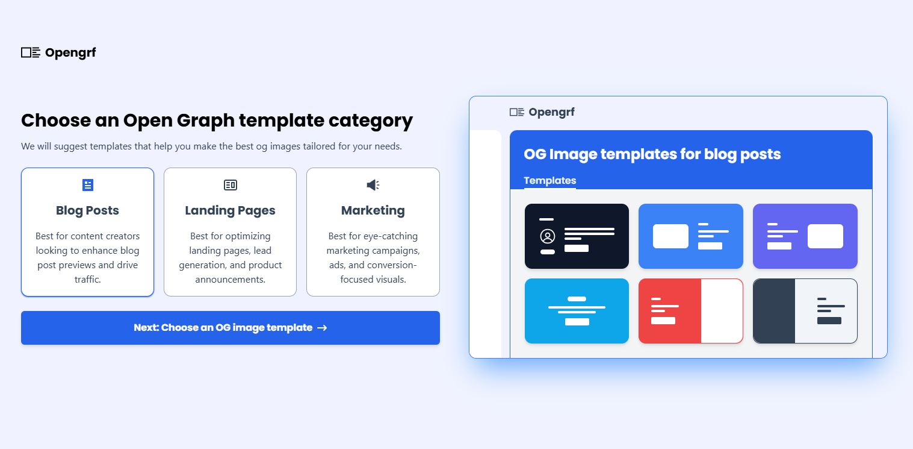
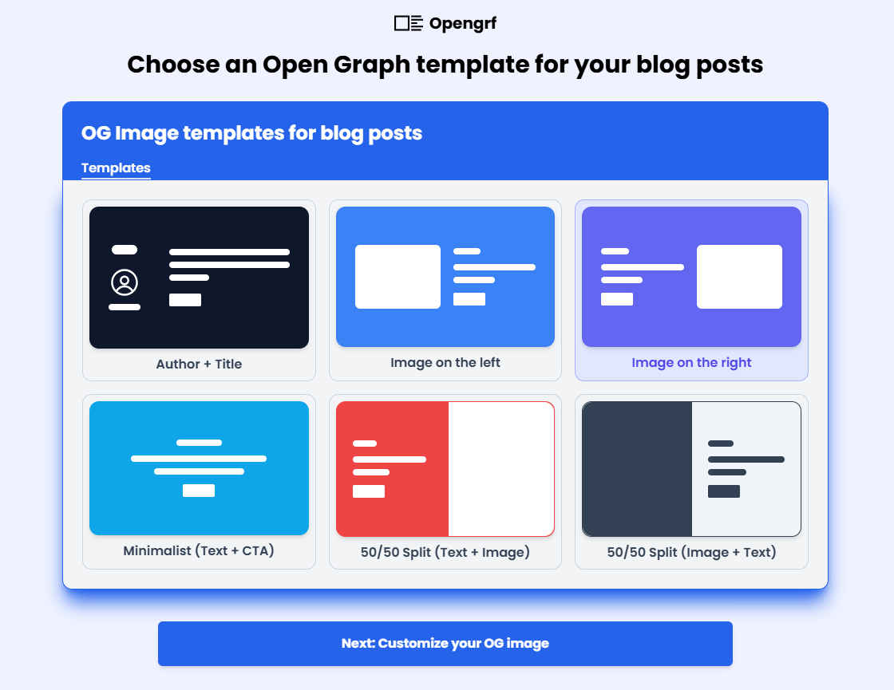

# OpenGRF

**OpenGRF** is a simple and fast OG (Open Graph) image generator built for developers, creators, and marketers who want to generate OG images tailored for different platforms with minimal effort.

## 🚀 What it does

OpenGRF allows users to:

- Create a new OG image project
- Name the project and select a category (e.g., Blog Post, SaaS & Product Pages, E-commerce, Marketing & Campaigns)

- Choose from a set of pre-designed OG image templates

- Select a target platform (Twitter, Facebook, LinkedIn, etc.)

- Customize the image:
  - Add a heading and body text
  - Upload a logo
  - Choose text color and background color
- Generate a ready-to-use OG image code snippet
- Copy the generated code in one click and paste it into the `<head>` of their website

## 💡 Use cases

OpenGRF is ideal for:
- Blog authors who want attractive OG images for posts
- SaaS and product owners building clean, consistent social previews
- E-commerce marketers promoting new collections or offers
- Campaign landing pages needing fast, beautiful OG visuals

## ⚙️ Status

Early development phase — core functionality coming together.